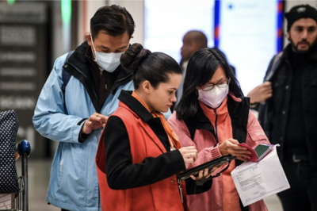
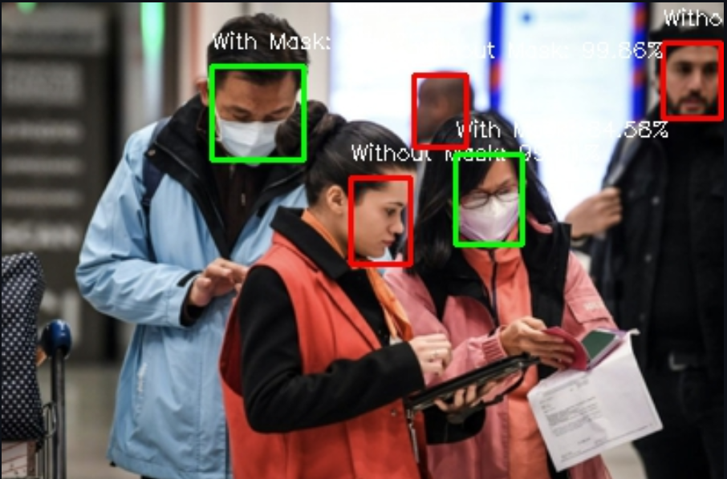
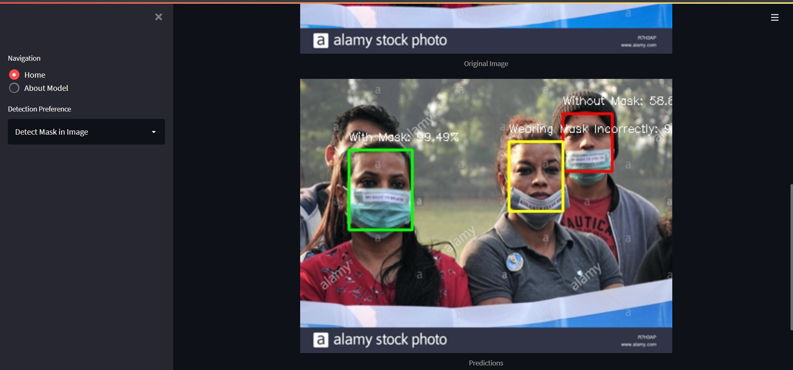

# Automated Face Mask Detection System

## Overview

This app detects human faces and proper mask wearing in images and webcam streams.

Because there is no particular treatment, wearing masks has proven to be a useful strategy
for preventing <a href="https://en.wikipedia.org/wiki/Severe_acute_respiratory_syndrome_coronavirus_2">COVID-19</a>.
In this simple project, a video camera detects if an individual is wearing a face mask or not or wearing face mask incoreectly in real-time.

## Dataset
The dataset consists of 2044 images of `With mask` class, 1886 images of `Without mask` class, and 2076 images of `Mask worn incorrectly` class. These images are collected from:- 
- <a href="https://github.com/cabani/MaskedFace-Net">Masked Face Dataset</a>
- <a href="https://github.com/Tkvmaster/Automated-Face-Mask-Detection-System/blob/main/image_scrapping.ipynb">Web Scraping Images from Google</a>
- <a href="https://github.com/Tkvmaster/Automated-Face-Mask-Detection-System/blob/main/capture_image.py">Captured Images using WebCam</a>

## Proposed System
To solve this data problem, I take a two-step approach. The first step is building a face mask classifier. I use MobileNet as the base model and train a custom head layer that will classify faces into one of three classes: no mask, mask worn incorrectly, and with mask.

The second step is to run a face detector model to locate all of the faces in an image and  extract face region from that image. Once a face is located, predictions are made using the classifier.

Lastly, these two steps are tied together for assessment on both still images and a live webcam feed.

I have used two methods for detecting faces, MTCNN for detection faces in images and OpenCV DNN for detecting faces in Live WebCam feed.

**MTCNN:** This model is made up of three stages: a proposal network or P-Net that grabs potential candidate windows, followed by a Refine network or R-Net that calibrates these candidates using bounding box regression, and an Output Network or O-Net that proposes facial landmarks. The MTCNN model detected 2,670 faces, the most out of the three detectors.

**OpenCV DNN:** The OpenCV module comes with a built-in DNN library, and uses a Caffe SSD model built on a Resnet 10 backbone. This model only detected 1,662 faces, but has a much faster performance on video. Predictions were made at 10.8 frames per second.

## Streamlit App
The Streamlit app provides the ability to upload an image and run a face mask detection using the MTCNN model as the detector. This will be a great way to test the generalizability of the model. My hope is to include a webcam version of this model as well but this is under construction at the moment.

## Results
<table class="bottom">
    <tr>
        <th>Input</th>
        <th>Output</th>
    </tr>
    <tr>
        <td></td>
        <td></td>
    </tr>
</table>

    <em>Original and Pridicted Images</em>

 

    
    <em>Streamlit App Screenshot</em>

## Licensing
The code in this project is licensed under [MIT License](LICENSE).

